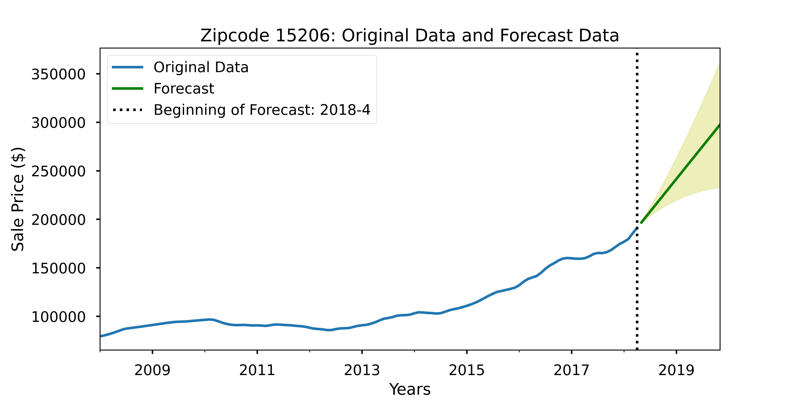
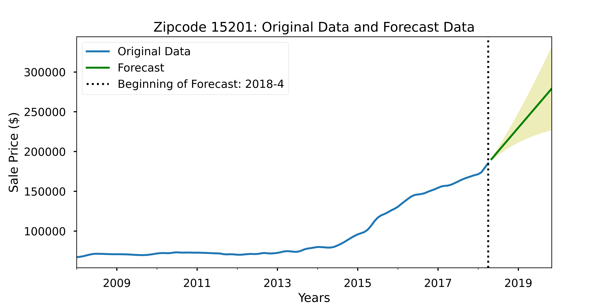
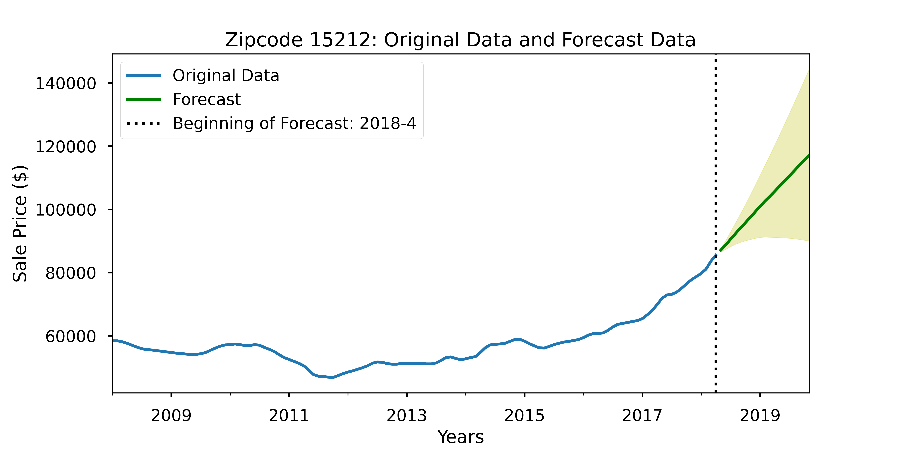
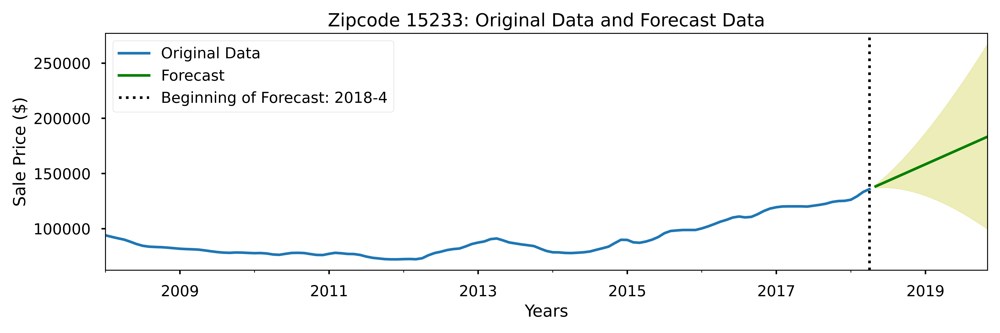
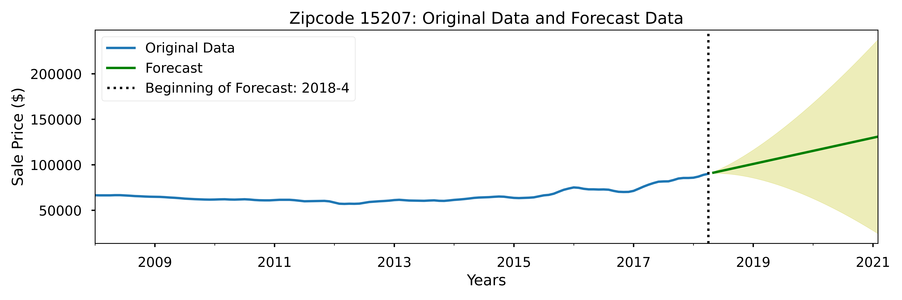
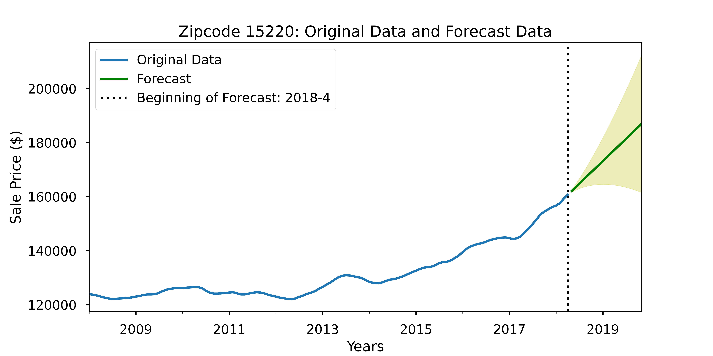
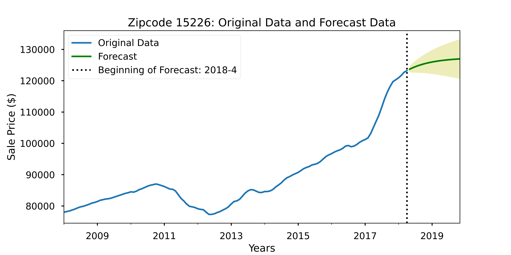

# **Best of the 'Burgh:** *Forecasting House Sales in Pittsburgh, PA*

**Author**: Ben McCarty

## Overview


Home buyers looking to buy a house, but intend to sell within 1.5 to 2 years.
Want to maximize return on investment while minimizing risk
Using Zillow data from 2008 to 2018 for time series forecasting
Results showed three neighborhoods that show both the top ROI and lowest risk of losing money, with two additional recommendations for ROI and two for lowest risks.
Recommend focusing on top three for best results.

---

## Business Problem

* Home buyers looking at short-term house purchases who want to choose to buy in the zip code with the best ROI at sale
* Forecasting prices based on prior house sales
* Calculated ROI based on initial and final forecasted prices
* Defined "risk" based on lower confidence interval for forecasts
* Want to get most money at sale, but want to minimize potential risk of losing money

---

## Data

* House sale data from Zillow for the range of years from 2008 to 2018
* Focused on 19 zip codes in Pittsburgh, PA
* Prices broken down monthly from May 2008 to April 2018

---
## Methods

* Used time series modeling to forecast prices
* Forecast length determined by number of months used to develop each zip code's model
    * Smallest number of months overall determined forecast for all zip codes
    * Ensured models would be evaluated at same point, regardless of total length of forecast per zip code
* Determining the initial and final forecast prices enabled me to calculate the return on investment
    * Defined as percentage of difference between final and initial pricing
    * Could be positive or negative
* Using the forecast's confidence interval, defined "risk" as lower interval (representing lowest forecasted ROI)
    * May be negative, indicating possiblity of losing money
---
## Results

* Forecasted prices for each zipcode; used forecast to calculate ROI
* Limited forecast range to the smallest forecast to compare each zip code at the same point in time
* Most of the forecasts' training results closely approxmiated the testing sets, indicating a high accuracy of the model
    * Some zip code models required tuning to bring forecast within confidence interval
    * Two or three zip code forecasts turned out poorly due to signficant variations in the overall data
        * These models would not be very accurate without further fine-tuning beyond this workflow.

### Top Three Zip Codes - Highest ROI, Lowest Risk

#### 15206 - East Liberty


#### 15201 - Lawrenceville


#### 15212 - North Shore


### 4th- and 5th-Highest Zip Codes by ROI

#### 15233 - Allegheny West


#### 15207 - Hazelwood


### 4th- and 5th-Highest Zip Codes by Lowest Risk

#### 15220 - Greentree


#### 15226 - Brookline


---
## Conclusions

* Best choices overall would be:
    * 15206 - East Liberty, 43% ROI , 17% Risk
    * 15201 - Lawrenceville 39% ROI,  17% Risk
    * 15212 - North Shore, 29% ROI, 4.13% Risk

* Additional high-ROI zip codes (with higher risk):
    * 15233 - Allegheny West, 27% ROI, -20% Risk
    * 15207 - Hazelwood, 20% ROI, -19% Risk

* Additional low-risk zip codes:
    * 15220 - Greentree, 13% ROI,  .6% Risk
    * 15226 - Brookline, 3% ROI, -2% Risk


Limitations and Future Work:

* Data ranges from 2008 - 2018
    * Would benefit from more up-to-date data
        * Could evaulate forecasts against actuals
        * Create new forecasts based on new data
* Further tuning of the forecast range may result in better results for the poorly-performing zipcodes.
* Including additional outside factors
    * Planned large-scale projects (infrastructure development; construction/developments)

---
## For More Information

Please review the full analysis in [the Jupyter Notebook](./Best_of_the_Burgh_Notebook.ipynb) or the [presentation](./P4P_Best_of_the_Burgh.pdf).

For any additional questions, please contact at:

**Ben McCarty**

* Email: [bmccarty505@gmail.com](mailto:bmccarty505@gmail.com)

* LinkedIn: [bmccarty505](http://www.linkedin.com/in/bmccarty505)

* GitHub: [github.com/BenJMcCarty](http://www.github.com/BenJMcCarty)

---
## Repository Structure

```
├── README.md                           
├── Best_of_the_Burgh_Notebook.ipynb
├── P4P_Best_of_the_Burgh.pdf
├── data
└── img
```
